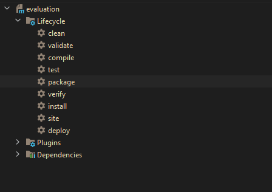

# Evaluation test

## Technology stack & other Open-source libraries

### Server - Backend

* 	[Jersey](https://eclipse-ee4j.github.io/jersey/) - Jersey framework provides it’s own API that extend the JAX-RS toolkit with additional features and utilities to further simplify RESTful service and client development
* 	[OpenJDK](https://openjdk.java.net/projects/jdk/11/) - Java11™ Platform, Standard Edition Development Kit
* 	[Spring Boot](https://spring.io/projects/spring-boot) - Framework to ease the bootstrapping and development of new Spring Applications
* 	[Maven](https://maven.apache.org/) - Dependency Management


###  Libraries and Plugins

* 	[Mapstruct-1.4.1.Final](https://mapstruct.org/) - MapStruct is a code generator that greatly simplifies the implementation of mappings between Java bean types based on a convention over configuration approach.
* 	[Lombok-1.18.12](https://projectlombok.org/) - Never write another getter or equals method again, with one annotation your class has a fully featured builder, Automate your logging variables, and much more.

### Others

* 	[git](https://git-scm.com/) - Free and Open-Source distributed version control system

### External Tools & Services

* [intellij Idea community](https://www.jetbrains.com/idea/) - A cross-platform IDE that provides consistent experience on the Windows, macOS, and Linux operating systems.
* [tomcat 9](https://tomcat.apache.org/download-90.cgi) - Apache Tomcat version 9.0 implements the Servlet 4.0 and JavaServer Pages 2.3 specifications from the Java Community Process.
* [Postman](https://www.getpostman.com/) - API Development Environment (Testing Docmentation)
* [Insomnia](https://insomnia.rest/) - The Desktop API client for REST.
* [gitignore.io](https://www.toptal.com/developers/gitignore) - Create useful .gitignore files for your project.

### Prerequisites

* intellij Idea community
* Java 11
* tomcat 9
* Postman or Insomnia

## Installing

* Default active profile is **`dev`**. When the application is running but you also have the **`production`** profile to perform the test.
* URL to access application UI: **http://localhost:8080/** or if you already have a custom port change it for that port

#### Running the application with IDE

There are several ways to run a Spring Boot application on your local machine. One way is to execute the `main` method in the `org.fjala.resoft.ReSoftApplication` class from your IDE.

* Download the zip.
* Unzip the zip file (if you downloaded one)
* Open Command Prompt and Change directory (cd) to folder containing pom.xml
* Open IntelliJ IDEA Community
     * File -> Import -> Existing Project -> Navigate to the folder where you unzipped the zip
     * Select the project
* Choose the Spring Boot Application file (search for @SpringBootApplication)
* Right Click on the file and Run as Java Application

### Running the application with Maven

Alternatively you can use the [Spring Boot Maven plugin](https://docs.spring.io/spring-boot/docs/current/reference/html/build-tool-plugins-maven-plugin.html)

### Testing with Maven or with IDE

*	Run only unit tests:

```shell
$ mvn clean test
```

### Packages
* `config` - application settings and Jersey;
* `evaluationtest` - package to endpoint evaluation;
  * `controllers` - to listen to the client;
  * `datatypes` - to hold our entities;
  * `service` - to hold business logic;
  * `dtos` - to hold our entities type dto;
* `home` -  package to endpoint home;
  * `controllers` - to listen to the client;
  * `datatypes` - to hold our entities;
  * `service` - to hold business logic;
  * `dtos` - to hold our entities type dto;

* `test/` - contains unit and integration tests
* `pom.xml` - contains all the project dependencies

### Description

####End Points
* http://localhost:8080/api/home - Random welcome message for the user
* http://localhost:8080/api/home/profile - Displays information of the profile that is active
* http://localhost:8080/api/evaluation - Displays information depending on whether the system property setting is active

####Profiles
Depending on the test to be performed, you can switch between profiles or directly change the ``app.system.property`` to perform tests.
* Dev - has the parameter app.system.property which is set to true by default if it is changed to false the endPoint http://localhost:8080/api/evaluation return 404.
* Production -has the parameter app.system.property which is set to false by default.

### Build and Deploy
#### Build with Ide


1.- Click in Maven

2.- Click in package

3.- Wait for the build to be completed

#### Deploy
Currently when the build is finished a .war file is generated with the name of evaluation.war.
which is located at the address target/

This file should be copied to the tomcat folder e.g.: C:\Program Files\Apache Software Foundation\Tomcat 9.0\webapps\

###Improvement opportunities
* Install and configure jacoco to have coverage of the application.
* Implement integration test.
* Improve error handling.
* Complete Uni test configuration for the Controllers.